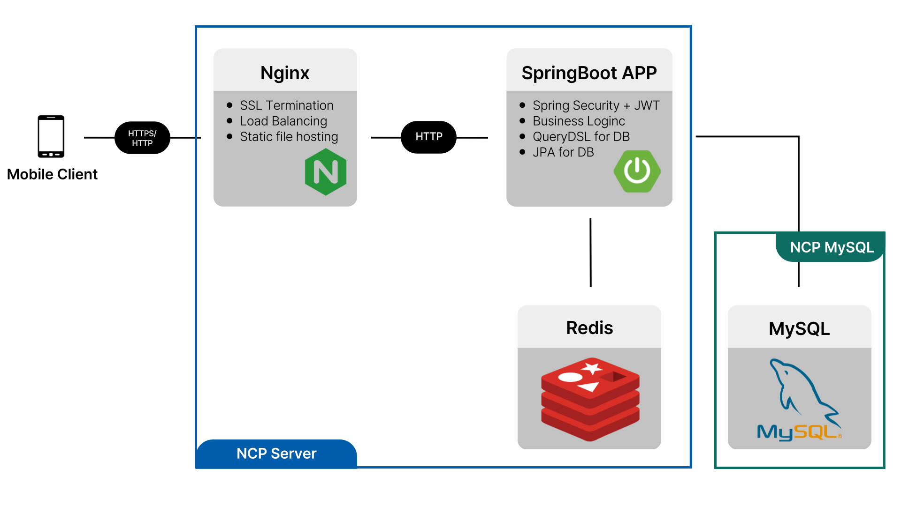
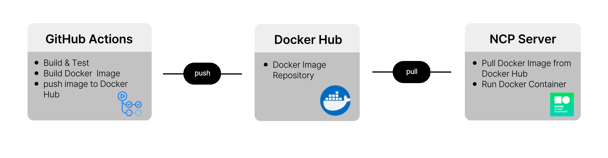

<br>

# 🍎 Newsee 프로젝트 소개

Newsee는 1일 1뉴스가 가능하도록 알림을 보내주는 앱 서비스입니다.

뉴스 보는 습관이 없거나, 내용 요약이 필요한 사람들에게, Newsee ! 👀
<br>
<br>

## 🏋🏻‍♀️ Backend Team
| 팀 | 이름 | 전공 | 역할  | 깃허브 아이디 |
|----| ----- | ----- | -------- | ------- |
| 팀장 | 유수민 | 컴퓨터공학전공 | 인프라 구축, 백앤드 코드 개발  | proysm |
| 팀원 | 안소희 | 컴퓨터공학전공 | 백엔드 코드 개발  | ansohui |

<br>


## 1. 개발 환경 및 기술 스택

##### Back-end
  
<br>
  

##### Database
 

##### CI/CD & DevOps
   

##### Tools


<br>


## 2. 시스템 아키텍처

```
✅ 백엔드 아키텍처
```


```
✅ CI/CD 아키텍처
```

<br>


## 3. 프로젝트 디렉토리 구조

<details>
<summary>Backend/src 구조 확인하기</summary>
<div markdown="1">

```
.
├── main
│   ├── java
│   │   └── dgu
│   │       └── cse
│   │           └── newsee
│   │               ├── apiPayload
│   │               │   └── exception
│   │               ├── app
│   │               │   ├── controller
│   │               │   └── dto
│   │               ├── config
│   │               ├── domain
│   │               │   ├── converter
│   │               │   ├── entity
│   │               │   └── enums
│   │               ├── jwt
│   │               ├── repository
│   │               ├── service
│   │               │   ├── alarm
│   │               │   ├── bookmark
│   │               │   ├── category
│   │               │   ├── kakao
│   │               │   ├── memo
│   │               │   ├── news
│   │               │   ├── playlist
│   │               │   ├── search
│   │               │   └── user
│   │               └── util
│   └── resources
│       ├── static
│       └── templates
└── test
    └── java
        └── dgu
            └── cse
                └── newsee
```

</div>
</details>

<br>


## 4. 주요 기술 설명

```
1. News API
```
- NewsAPI와 NewsDATA API를 사용하여 오늘의 뉴스를 가지고 온다. (fetch)
- 매일 한 번씩 뉴스를 가지고 오고 24h가 지나면 다시 뉴스 정보를 갱신한다. (re-fetch)


```
2. GPT Shorts API
```
- 뉴스의 요약본을 제공하기 위해 GPT API를 사용한다.
- 3줄로 요약하며, 이미 요약본이 있는 News의 경우 저장된 요약본을 사용하고, 요약본이 아직 없는 경우만 GPT에 요청을 보낸다.

```
3. Alarm News
```
- 알림을 보낼 뉴스는 랜덤으로 선택한다.
- 사용자가 설정한 관심분야 중 1개를 고르고, 관심분야의 뉴스 중 1개를 골라서 client에게 전달한다.

<br>


## 📪 개발 문서
[🔗 API 명세서 확인](https://proysm.notion.site/API-152b4ca715b080569c55debdad2cf031 "API 명세서")

[🔗 ERD 확인](https://proysm.notion.site/ERD-152b4ca715b0804e891ec456faff3d87 "ERD")

<br>

## 🎀 Meeting Miutes
[🔗 회의록 확인](https://proysm.notion.site/152b4ca715b080aab85ffe4bc3465567 "Newsee 회의록")

<br>

## 🌴 Branch Style
| 이름 | 설명 |
| --- | --- |
| main | PR을 거쳐 오류가 없는 브랜치 |
| prod | 배포에 사용되는 브랜치 |
| Feat/#이슈번호 | 기능 개발에 사용되는 브랜치 |
| Update/#이슈번호 | 기능 업데이트에 사용되는 브랜치 |
| Refactor/#이슈번호 | 리팩토링에 사용되는 브랜치 |
| Bug/#이슈번호 | 버그 해결에 사용되는 브랜치 |

<br>

## 🎯 Commit Convention
| 제목 | 설명 |
| --- | --- |
| Feat : | 새로운 기능 추가 |
| Fix : | 버그 수정 |
| Docs : | 문서 수정 |
| Update : | 기타 업데이트 |
| Style : | 코드 포맷 변경, 세미콜론 누락, 코드 변경 없음 |
| Refactor : | 프로덕션 코드 리팩터링 |

